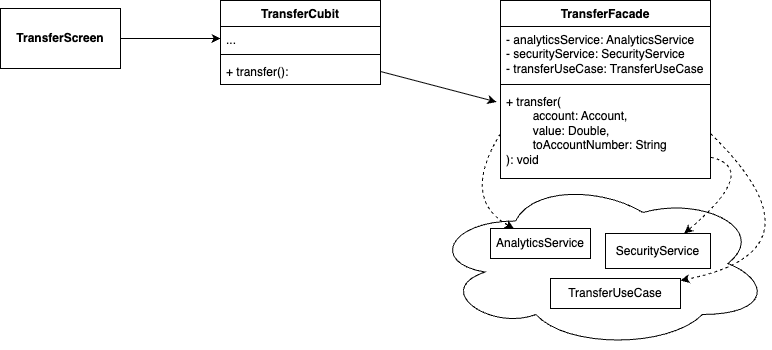

<h1 align="center">
   
  
   
  Pragma
   
</h1>

<h4 align="center">Patrón de diseño Facade, implementación y ejemplo en Flutter</h4>

  
  

Este proyecto hace parte del artefacto asociado a los deseables en el uso del patrón de diseño Facade, según el caso de uso. Debemos tener en cuenta un buen análisis para la implementación de este tipo de soluciones y evitar caer en la sobreingeniería. Para ejemplificar la implementación de este patrón, hemos optado por un escenario relacionado con una transferencia bancaria con una interfaz grafica basica. En este caso, el usuario podra seleccionar una cuenta origen, un valor a transferir y una cuenta destino(solo el numero de cuenta), en donde usando el patrón Facade, se oculto y encapsulo los diferentes procesos internos de una transferencia, como lo serian las analiticas, procesos de seguridad y finalmente el envio del dinero.

A continuación se comparte el diagrama de clases del proyecto, enfocado en la implementación del patrón de diseño.

  

  <a href="#topicos">Topicos</a> •
  <a href="#instalación-y-ejecución">Instalación y ejecución</a> •
  <a href="#consideraciones">Consideraciones</a> •
  <a href="#tecnologias">Tecnologías</a> •
  <a href="#credits">Autores</a> •
  <a href="#related">Relacionados</a>

## Topicos

* Flutter
* Dart
* Facade Pattern

## Instalación y ejecución

Para clonar y ejecutar está aplicación, necesitas [Git](https://git-scm.com) y [Flutter SDK](https://docs.flutter.dev/get-started/install) instalados en tu equipo. Una vez clonado el repositorio, es recomendable ejecutar el comando `flutter pub get`, comando el cual obtendra las dependencias del proyecto, una vez obtenidas las dependencias necesarias del proyecto mediante el anterior comando. Podemos  compilar el proyecto de ejemplo ya sea en el emulador, simulador o dispositivo físico.

## Consideraciones
Para tomar una decisión informada sobre el uso del patrón de diseño Facade, es esencial evaluar ciertos aspectos clave que garantizan un diseño eficiente, mantenible y escalable. A continuación, se presentan los principales puntos a considerar:

1. **Simplificaión de acceso**
- Si quieres o requieres simplificar y unificar diferentes subsistemas presentando una interfaz simplificada

2. **Extensibilidad y Escalabilidad**
- Especialmente util en el escalamiento al poder controlar los cambios en los subsistemas sin requerir ajustar el consumidor(por ejemplo, la vista)

3. **Compatibilidad con Principios SOLID**
- Una buena implementación de Facade está alineada con los principios SOLID, siempre que su responsabilidad se limite a la orquestación de flujos.
    - Una implementación incorrecta puede conllevar violar el principio de unica responsabilidad, derivando en un **God Object**, clase con muchas responsabilidades

- Favorece la Inversión de Dependencias (DIP) al depender de abstracciones en lugar de implementaciones concretas.

4. **Facilidad de Mantenimiento**
- Reduce la complejidad del código al centralizar diferentes subsistemas, disminuyendo el impacto general de los posibles cambios.

5. **Impacto en el Rendimiento**
- Puede introducir una ligera sobrecarga debido a la delegación, por lo que su uso debe justificarse cuando el beneficio del desacoplamiento sea mayor.

> [!TIP]  
> Utiliza el patrón **Facade** cuando quieras implementar una interfaz simple para ejecutar una lista de subtareas mas complejas

> [!TIP]  
> Aplica el patrón cuando quieras reducir el acoplamiento entre el cliente y varios subsistemas, permitiendo que estos evolucionen sin impactar directamente a los consumidores.

> [!TIP]  
> Utiliza Facade cuando desees orquestar flujos sin necesidad de implementar logica extra en la vista.

## Tecnologías
-   [Flutter](https://flutter.dev/)
-   [Dart](https://dart.dev/)

## Autores

| [ Cristian Ramirez](https://github.com/juliocruizc)   | 
:------------------------------------------------------------------------------------------------------------------------------------------------------------------------------:|

## Relacionados

- Los patrones de diseño son soluciones habituales a problemas que ocurren con frecuencia en el diseño de software. Son como planos que se pueden personalizar para resolver un problema de diseño particular de tu código. Para mayor información recomendamos visitar el siguiente [enlace](https://refactoring.guru/es/design-patterns).
